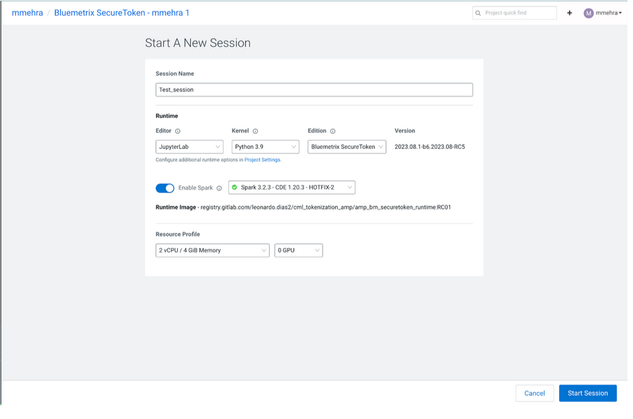

## Securing Sensitive Data in CDP with Bluemetrix

SecureToken is a Spark-based solution that makes data tokenization effortless within the Cloudera Data Platform (CDP). Fully integrated and compliant with NIST and FIPS 140-3, it securely tokenizes and detokenizes data without the data leaving the LakeHouse. It supports a wide range of use cases, GDPR compliance, ML/analytics, secure data sharing, and more.


This repo shows you how to quickly leverage Cloudera Machine Learning (CML) to securely tokenize data, scale effortlessly, and use this tokenization capability in your existing data pipelines - in hours, not days or weeks.

## AMP Architecture

## Bluemetrix SecureToken AMP Overview
This AMP will show how Bluemetrix SecureToken provides a simple process for tokenizing and detokenizing data when using CML to help protect sensitive data.

It includes a Jupyter notebook that provides examples of how the tokenization and detokenization of the data works.

## Prerequisites
- CML Session Editor should be JupyterLab
- Bluemetrix SecureToken ML Runtime is required
- Cloudera platform should be up and running
- CML workspace should be created
- Access to the private repository and the AMP

## Cloudera platform should be up and running
Please use the following documentation to setup your Cloudera Platform based on your form factor

- Cloudera on-prem (Base Cluster): [CDP Private Cloud Base Installation Guide](https://docs.cloudera.com/cdp-private-cloud-base/7.1.9/installation/topics/cdpdc-installation.html)
- Cloudera on-prem (Data Service Cluster): [Requirements | CDP Private Cloud](https://docs.cloudera.com/cdp-private-cloud-data-services/1.5.4/installation-ecs/topics/cdppvc-requirements-ecs.html)
- Cloudera on public cloud: [Deploy CDP using Terraform](https://docs.cloudera.com/cdp-public-cloud/cloud/getting-started/topics/cdp-deploy_cdp_using_terraform.html)

## CML workspace should be created
Please use the following documentation to set up your ML workspace on the existing Cloudera platform.

[Provisioning ML Workspaces](https://docs.cloudera.com/machine-learning/cloud/workspaces/topics/ml-provision-workspaces.html)


## Request to access private repository
SecureToken is based on a customized ML Runtime Image and its content is stored on a private Gitlab repository.

To access the private repository, it is required to fill the [Registration Form](https://dbh7xjc3mu6.typeform.com/to/nMIBRkxM) and provide the ssh-key of your ML workspace.

Steps to do that are given below **Cloudera Machine Learning** > **ML Workspace** > Select **User Settings** from the menu on the left > Select **Outbound SSH*** > Copy the **User Public SSH Key**

<ins>**Add this key to a text file and attach it to the above email.**</ins>

Access will be allowed to
The private Gitlab Docker Registry (to download the ML Runtime)
The Gitlab Repository (to clone the AMP contents).

NOTE : Ap part of the response you will receive credentials(username and password) to access the docker repository


## Installation

### Register the Docker Registry Credentials

Before registering your ML Runtime, it is required to configure the credentials provided on the previous step on your CML Kubernetes Cluster. Please, consult the [documentation](https://docs.cloudera.com/machine-learning/cloud/runtimes/topics/ml-add-docker-registry-credentials-runtimes.html) for additional information.
Follow the steps below to configure the credentials:


**Step 1**: Download the Kubeconfig associated with your ML Workspace from the **Actions** menu

**Step 2**: Connect to the kubernetes cluster

<ins>**AWS**</ins>
- You need to install
    - **Kubectl**: [Set up kubectl and eksctl - Amazon EKS](https://docs.aws.amazon.com/cli/latest/userguide/getting-started-install.html)
    - **Aws-iam-authenticator**: brew install aws-iam-authenticator
    - **AWS CLI**: [Install or update to the latest version of the AWS CLI - AWS Command Line Interface](https://docs.aws.amazon.com/cli/latest/userguide/getting-started-install.html)
- Connect your AWS account to the aws-iam-authenticator with your **ACCESS KEY** and **SECRET KEY** then run
```
$ aws configure
```
- Grant your ARN access to the ML Workspace and get the kube-config.yaml ([Granting Remote Access to ML Workspaces](https://docs.cloudera.com/machine-learning/cloud/workspaces/topics/ml-workspaces-remote-access.html))
- View the current running pods

```
$ KUBECONFIG=kube-config.yaml kubectl get pods --all-namespaces
 ```

<ins>**Azure**</ins>

1. **Access Configuration**:
    - Ensure your Azure GroupID (ObjectID) is configured for access to the AKS cluster
    - [Find your ObjectID and tenant details in the Azure portal](https://learn.microsoft.com/en-us/azure/azure-portal/get-subscription-tenant-id)
    - Make sure your Azure GroupID (ObjectID in Azure portal) is configured in GRANT ACCESS.
    - At the time of document preparation, restriction for Azure ID access to AKS cluster is only applicable for CDW.
    - In order to find ObjectID’s for user, group and tenant etc. on azure portal please follow the link Find tenant ID, domain name, user object ID
2. **Login to Azure CLI**:
    - Sign in using Azure CLI by running the command:
   ```
   az login --tenant <Tenant-ID>
   ```
    - Complete login via the web browser.
3. Export KUBECONFIG variable and set the path to the kubecofig downloaded
```
export KUBECONFIG=<path-to-kubeconfig-file>
```
4. Install KubeLogin:
    - Install the KubeLogin client (if required) to generate a token for authentication.
      You may refer to instructions to install it on your terminal here, based on the OS running on your terminal.

5. Authenticate and Use Kubectl:
    - Run any `kubectl` command (e.g., `kubectl get ns`).
    - You will be prompted to authenticate via a device code.
    - Use a web browser to open https://microsoft.com/devicelogin and enter the code shown in the terminal.
    - After authentication, you can use kubectl commands to manage your AKS cluster.

**Step 3** : Execute the following command to create the credentials on your cluster. Use the credentials provided on the previous step.
```
kubectl --kubeconfig <your-downloaded-cml-kubeconfig> create secret docker-registry regcred --docker-server=registry.gitlab.com --docker-username=<username-shared-registry> --docker-password='<password-shared-registry>' -n mlx
```


## Register ML Runtime

With the credentials registered, we will now register the new ML Runtime according to the [documentation](https://docs.cloudera.com/machine-learning/cloud/runtimes/topics/ml-registering-customized-runtimes.html):

**Step 1**: As an administrator, access the Machine Learning workspace.

**Step 2:** Click **Runtime Catalog** from the Navigation panel:


**Step 3** : Click the Add Runtime button in the upper right corner.


**Step 4** : In the Add Runtime window, enter the below url to use the customized Runtime Docker image
```
registry.gitlab.com/leonardo.dias2/cml_tokenization_amp/amp_bm_securetoken_runtime:RC01 
```

As ML Runtimes are identified based on certain attributes, metadata (such as Editor, Kernel, Edition, Version, and Maintenance Version) must be unique to add new Customized Runtimes to a deployment. Customized ML Runtimes must have different Edition text compared to Cloudera supported versions.


**Step 5** : Click Validate.

CML will use the provided URL to fetch the Docker image and validate if it can be used as a customized Runtime.
If the Docker image is successfully validated, CML will display the metadata information of the image. The new customized Runtime will be visible in the Runtime Catalog and accessible over the different workloads.


**Step 6** : **Enable** the Runtime
In the list of Runtime search for **Bluemetrix** , select the **Runtime** > **Click on Actions** > select **Set to Enabled**


**Step 7** : Add to default list
Check the Default box on the **Bluemetrix** runtime


## Add AMP Catalog

Once the ML Runtime is registered and available, follow the [instructions](https://docs.cloudera.com/machine-learning/cloud/applied-ml-prototypes/topics/ml-amp-add-catalog.html) to install the AMP in your workspace.

Go to:

**ML Workspace** > **Site Administration** > **AMPs** > **Add New Source(Catalog URL)** > Click **Add Source** > Select **Catalog File URL**, fill with the **URL to source** and click on **Add Source**:

Catalog URL : https://raw.githubusercontent.com/bluemetrix-com/securetoken-amp/main/catalog.yaml

After adding the Catalog Source, it will be listed as show on the image below:


## Deploy AMP
**Step 1**: Go to the AMP homepage in your ML Workspace and in the top menu select **Bluemetrix** in the **Source** dropdown.


**Step 2**: Select the AMP and click **Configure & Deploy**


Once you are on the AMP configuration page make sure the right Edition is selected along with the right version of Python. [ Refer the below screenshot ]


Click on Launch Project


This will take care of installing all the dependencies required and the project will now be available on your **Project** page.


Clicking on **Projects** in the left menu will take you to the Projects homepage where you will see your AMP as a project now


Clicking on the name of the project will take you inside the project where you will be able to view and execute your scripts.

## Execution

### Create a session

To run the steps which are a part of the AMP we will first need to create a **New Session** by clicking on the top right hand corner.


Enter the session details:


| Field                                 | Value                  |
|---------------------------------------|------------------------|
| Session Name                          | BluemetrixTestSession  |
| Runtime Editor                        | JupyterLab             |
| Runtime Kernel                        | Python 3.9             |
| Edition                               | Bluemetrix SecureToken |
| Enable Spark                          | Yes - Spark 3.2.3      |
| Setup Steps - Execute AMP setup steps | Enabled                |


|Click on Start Session ||
|-|-|

### Execute the script

Select the script that needs to be run from the file browser on the left.
**File Name : Tokenization_Example.ipynb**

From the above menu select **RUN** > **RUN ALL CELLS**

This will execute all the code blocks in your notebook.

## SecureToken Jupyter Notebook

The notebook included in the AMP will cover the tokenization/detokenization of data for Call Records and Subscriber Summary CSV file.

### Sections

The SecureToken Jupyter Notebook includes the following sections:

1. **Setup the Spark Session**: This section will start the Spark Session

2. **Initialize The Tokenization Instance With A Locally Stored Key**: will initialize the SecureToken instance with the encryption key included in the project

3. **Read Sample Data from Workspace**: will create a dataframe based on the Call Records CSV file

4. **Show Top5 Destination Numbers**: will show the 5 top destination numbers on original format

5. **Show Top5 Destination Across Original, Tokenized and Detokenized Data Sets**: will show the 5 top destinations across three different charts (Original, Tokenized and Detokenized)

6. **Save Call Records CSV with Tokenized destination to compare De-Tokenization / Original execution time**: Save a new CSV file named tok_call_log.csv with the Call Records data including the destination field tokenized.

7. **Show Execution Time Original vs Tokenized**: will show a chart comparing the execution time when working with data from a CSV file with the original data and the execution time when working with data from a CSV with tokenized data (which includes the detokenization stage)

8. **Show Original, Tokenized & Detokenized Destination Values Side By Side**: will show a table with the 5 top destination numbers as seen on the original format, tokenized format and detokenized format. This example shows how SecureToken is able to retrieve the original data back.

9. **Show Top 5 Origin Numbers**: will show the 5 top origin numbers on original format

10. **Show Top 5 Origin Numbers Across Original, Tokenized & Detokenized Data Sets**: will show the 5 top origin across three different charts (Original, Tokenized and Detokenized)

11. **Show Original, Tokenized & Detokenized Origin Values Side By Side**: will show a table with the 5 top origin numbers as seen on the original format, tokenized format and detokenized format. This example shows how SecureToken is able to retrieve the original data back.

12. **Load Secondary Dataset**: will create a second dataframe based on the Subscriber Summary CSV file

13. **Join Secondary Dataset with Top 5 Origin Numbers**: join the two dataframes using the origin number on original format. Shows the content of the 5 top numbers.

14. **Tokenize Both Data Sets and Recreate View**: shows a table with the top 5 origin numbers (similar to the previous item), but with the origin and current_ip columns tokenized.

15. **Detokenize The Complete Analysis Above**: will detokenize the data shown on the previous item and show that the detokenized data is retrieved with this process.

16. **Save Call Records CSV with Tokenized origin to compare De-Tokenization / Original execution time**: Save a new CSV file named origin_tok_call_log.csv with the Call Records data including the destination field tokenized.

17. **Save Subscriber Summary CSV with Tokenized origin  and current_ip to compare De-Tokenization / Original execution time**: Save a new CSV file named origin_ip_tok_sub_summary.csv with the Call Records data including the destination field tokenized.

18. **Show Execution Time Original vs Tokenized for joining datasets**: will show a chart comparing the execution time when working with data from a CSV file with the original data and the execution time when working with data form a CSV with tokenized data (which includes the detokenization stage)

19. **Show Joined Execution Time Original vs Tokenized**: will show a chart comparing the execution time when working with data from CSV files with the original data (both Call Records and Subscriber Summary) and the execution time when working with data from CSVs with tokenized data (which includes the detokenization stage)

20. **Summarize Tokenized & Detokenized Joined Data in a Graph**: will show two charts with the summarized data from the previous items.

## Using different Data Sets
Bluemetrix SecureToken tokenize/detokenize data from a Dataframe. Any type of source (Iceberg, CSV, Hive, etc) can be used as a source for the Tokenization.

## Tokenization Minimum Size and leading zeros

Since values will be tokenized with format-preserving encryption, it requires a minimum number of possibilities (1,000,000). This number is calculated by X^Y > 1,000,000, where X is the number of characters in the alphabet, and Y is the desired input length. For example, in the case of the numeric alphabet, the minimum length required is 6 (10^6), as the numeric alphabet has 10 possibilities (0-9).

The underlying tokenization algorithm treats everything as a string and requires you to specify the alphabet associated with the string. We can provide different alphabets to achieve different functionality. For example, providing an alphabet with the character “0123456789” will allow us to tokenize numbers such as credit cards or phone numbers. However, there can be some caveats. If you wish to store the output as an actual numeric type, any leading zeros will be dropped and could break detokenization. In such cases, if you knew that all values are of a fixed length, you could write a routine to support this use case.

One example of using fixed-length logic is when dealing with IPv4 addresses. In order to stay within valid IP ranges, all octets are first converted to binary form and padded to be a fixed length of 8 before being concatenated into a single 32-character binary representation. Tokenization/detokenization is then called with a binary alphabet and the reverse logic is applied to convert this new value back into an IPv4 string. 

Other examples would include datasets like credit cards, phone number, e-mails, etc and these will be added to the AMP library over the coming weeks and months.

## The Fine Print

IMPORTANT: Please read the following before proceeding. This AMP includes or otherwise depends on certain third-party Python packages. Information about such third-party software packages is made available in the notice file associated with this AMP. By configuring and launching this AMP, you will cause such third party python packages to be downloaded and installed into your environment from their respective public repositories. For each third-party python package, please see the notice file and the applicable websites for more information, including the applicable license terms.

If you do not wish to download and install the third-party Python packages, do not configure, launch or otherwise use this AMP. By configuring, launching or otherwise using the AMP, you acknowledge the foregoing statement and agree that Cloudera and Bluemetrix are not responsible or liable in any way for the third-party python packages.

## LICENSE

Refer to the Project <ins>**LICENSE**</ins> file in the root directory.